# 封面风格对比报告

文章：**vibecoding："让 AI 先计划再实现"是什么意思？如何实现？**

生成参数：Google Gemini / 3:4 / normal quality

---

## 简洁组（7 种，手机端友好）

### 01 极简黑白

- **风格**：minimal / mono / flat-vector / clean font / subtle mood
- **特点**：最干净，纯概念，黑白灰三色
- **图片**：[查看](01-minimal-mono/cover.png)

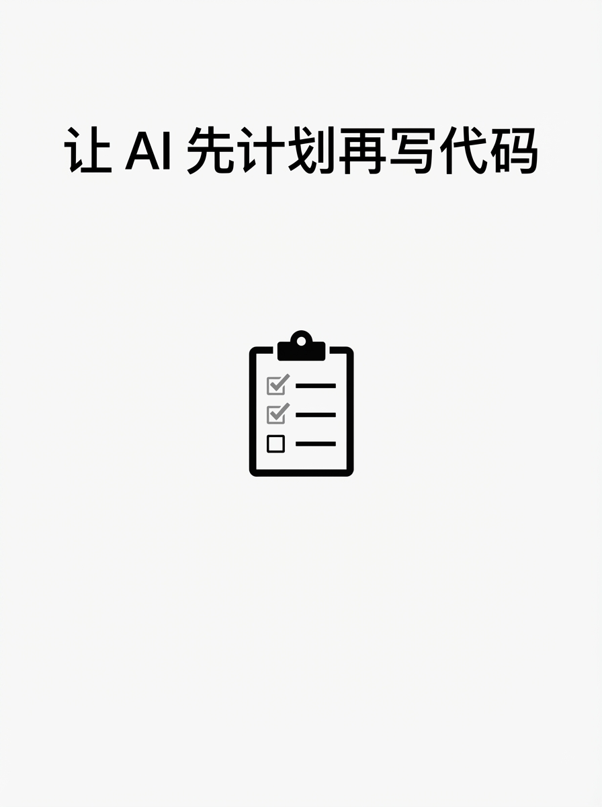

---

### 02 极简数码

- **风格**：minimal / mono / digital / clean font / subtle mood
- **特点**：数码感极简，像素/网格元素
- **图片**：[查看](02-minimal-digital/cover.png)

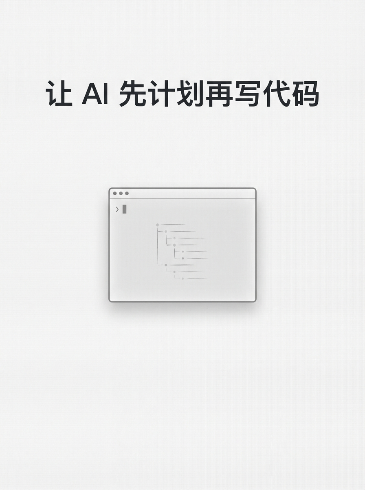

---

### 03 字体主导-暗色

- **风格**：typography / dark / digital / display font / bold mood
- **特点**：大字醒目，暗色背景，强视觉冲击
- **图片**：[查看](03-typography-dark/cover.png)

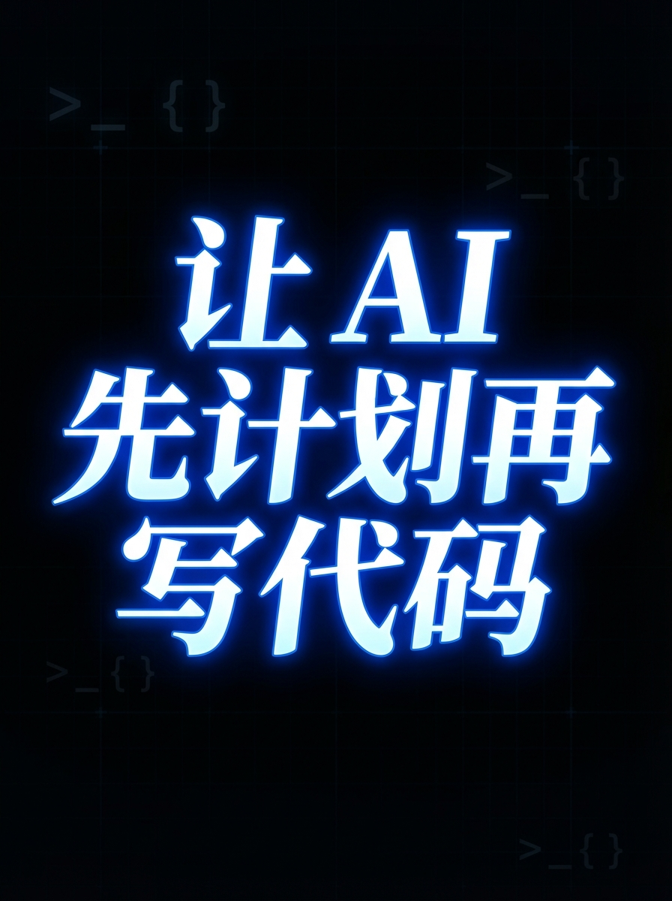

---

### 04 字体主导-冷色

- **风格**：typography / cool / flat-vector / clean font / bold mood
- **特点**：科技感蓝色调，标题突出
- **图片**：[查看](04-typography-cool/cover.png)

---

### 05 概念-冷色数码

- **风格**：conceptual / cool / digital / clean font / balanced mood
- **特点**：清晰概念图，蓝色科技感
- **图片**：[查看](05-conceptual-cool/cover.png)

---

### 06 概念-扁平暖色

- **风格**：conceptual / warm / flat-vector / clean font / balanced mood
- **特点**：温暖但简洁的概念图，橙/黄色调
- **图片**：[查看](06-conceptual-warm/cover.png)

---

### 07 Notion 风

- **风格**：conceptual / mono / digital / clean font / subtle mood
- **特点**：类 Notion 文档封面，干净工具感
- **图片**：[查看](07-notion-style/cover.png)

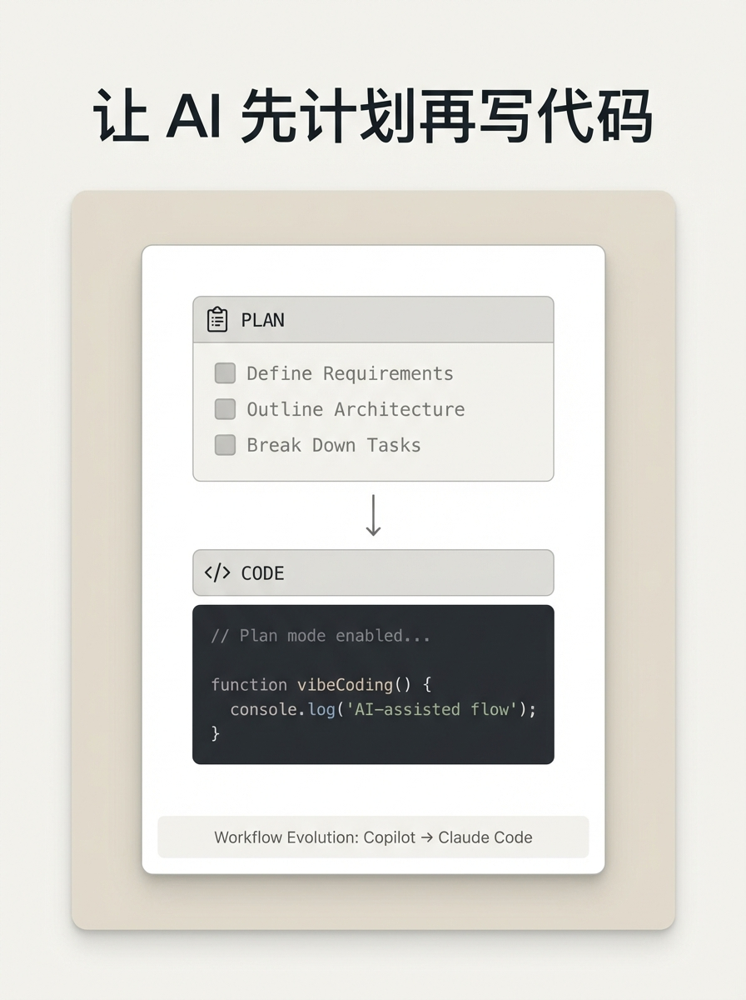

---

## 表现力组（5 种，视觉丰富）

### 08 温暖手绘

- **风格**：scene / warm / hand-drawn / handwritten font / balanced mood
- **特点**：个人旅程感，手绘线条
- **图片**：[查看](08-warm-handdrawn/cover.png)

---

### 09 手绘笔记

- **风格**：scene / warm / painterly / handwritten font / balanced mood
- **特点**：水彩叙事感，笔记本质感
- **图片**：[查看](09-handdrawn-notes/cover.png)

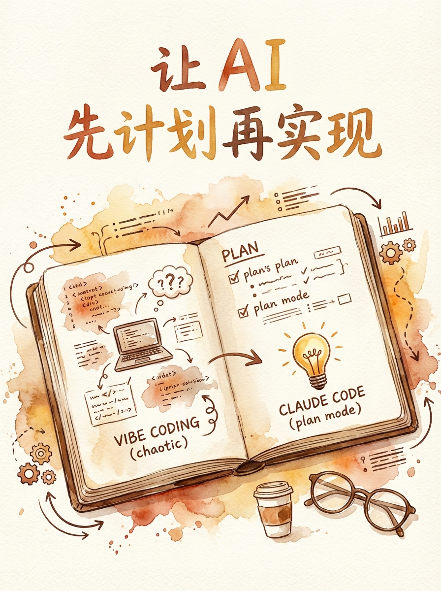

---

### 10 概念隐喻

- **风格**：metaphor / elegant / hand-drawn / handwritten font / balanced mood
- **特点**：蓝图→成品的隐喻，手绘+精致
- **图片**：[查看](10-concept-metaphor/cover.png)

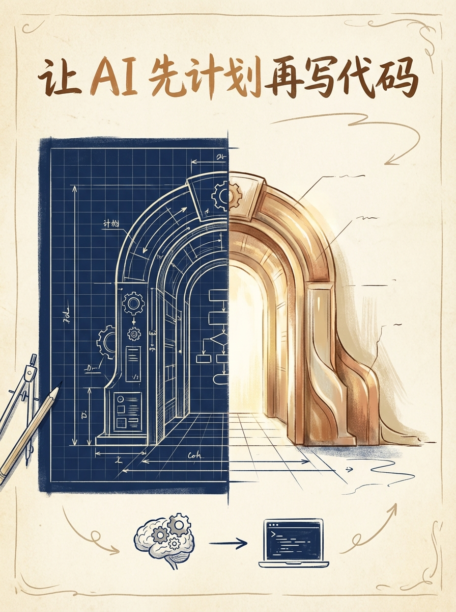

---

### 11 复古数码

- **风格**：hero / retro / digital / display font / bold mood
- **特点**：复古海报风，霓虹/像素元素
- **图片**：[查看](11-retro-digital/cover.png)

---

### 12 粉笔教学

- **风格**：metaphor / dark / chalk / handwritten font / balanced mood
- **特点**：黑板教学风，粉笔手写质感
- **图片**：[查看](12-chalk-teaching/cover.png)

---

## 快速对比维度

| #  | 风格       | 手机可读性 | 信息密度 | 个人调性  | 科技感   | 通用性   |
| -- | -------- | ----- | ---- | ----- | ----- | ----- |
| 01 | 极简黑白     | ★★★★★ | ★    | ★★    | ★★★   | ★★★★★ |
| 02 | 极简数码     | ★★★★★ | ★★   | ★★    | ★★★★  | ★★★★★ |
| 03 | 字体主导-暗色  | ★★★★★ | ★★   | ★★★   | ★★★★  | ★★★★  |
| 04 | 字体主导-冷色  | ★★★★★ | ★★   | ★★    | ★★★★★ | ★★★★  |
| 05 | 概念-冷色数码  | ★★★★  | ★★★  | ★★    | ★★★★★ | ★★★★  |
| 06 | 概念-扁平暖色  | ★★★★  | ★★★  | ★★★★  | ★★    | ★★★★  |
| 07 | Notion 风 | ★★★★★ | ★★   | ★★★   | ★★★★  | ★★★★★ |
| 08 | 温暖手绘     | ★★★   | ★★★  | ★★★★★ | ★     | ★★★   |
| 09 | 手绘笔记     | ★★★   | ★★★  | ★★★★★ | ★     | ★★★   |
| 10 | 概念隐喻     | ★★★   | ★★★★ | ★★★★  | ★★    | ★★★   |
| 11 | 复古数码     | ★★★★  | ★★★  | ★★★   | ★★★★  | ★★    |
| 12 | 粉笔教学     | ★★★   | ★★★  | ★★★★  | ★★    | ★★★   |

---

## 变体组：暖色（基于 3/4/5，改 palette 为 warm）

### 13 字体主导-暖色暗底

- **风格**：typography / warm / digital / display font / bold mood
- **基于**：03（暗色→暖色，深棕/琥珀/金色）
- **图片**：[查看](13-typography-warm-dark/cover.png)

---

### 14 字体主导-暖色

- **风格**：typography / warm / flat-vector / clean font / bold mood
- **基于**：04（冷色→暖色，橙/金/米白）
- **图片**：[查看](14-typography-warm/cover.png)

---

### 15 概念-暖色数码

- **风格**：conceptual / warm / digital / clean font / balanced mood
- **基于**：05（冷色→暖色，琥珀/珊瑚/奶油）
- **图片**：[查看](15-conceptual-warm-digital/cover.png)

---

## 变体组：Clean/Display 字体（基于 8/9/10/12，改 font）

### 16 温暖手绘-clean font

- **风格**：scene / warm / hand-drawn / clean font / balanced mood
- **基于**：08（handwritten→clean geometric sans-serif）
- **图片**：[查看](16-warm-handdrawn-clean/cover.png)

---

### 17 手绘笔记-display font

- **风格**：scene / warm / painterly / display font / balanced mood
- **基于**：09（handwritten→bold decorative display）
- **图片**：[查看](17-handdrawn-notes-display/cover.png)

---

### 18 概念隐喻-clean font

- **风格**：metaphor / elegant / hand-drawn / clean font / balanced mood
- **基于**：10（handwritten→clean geometric sans-serif）
- **图片**：[查看](18-concept-metaphor-clean/cover.png)

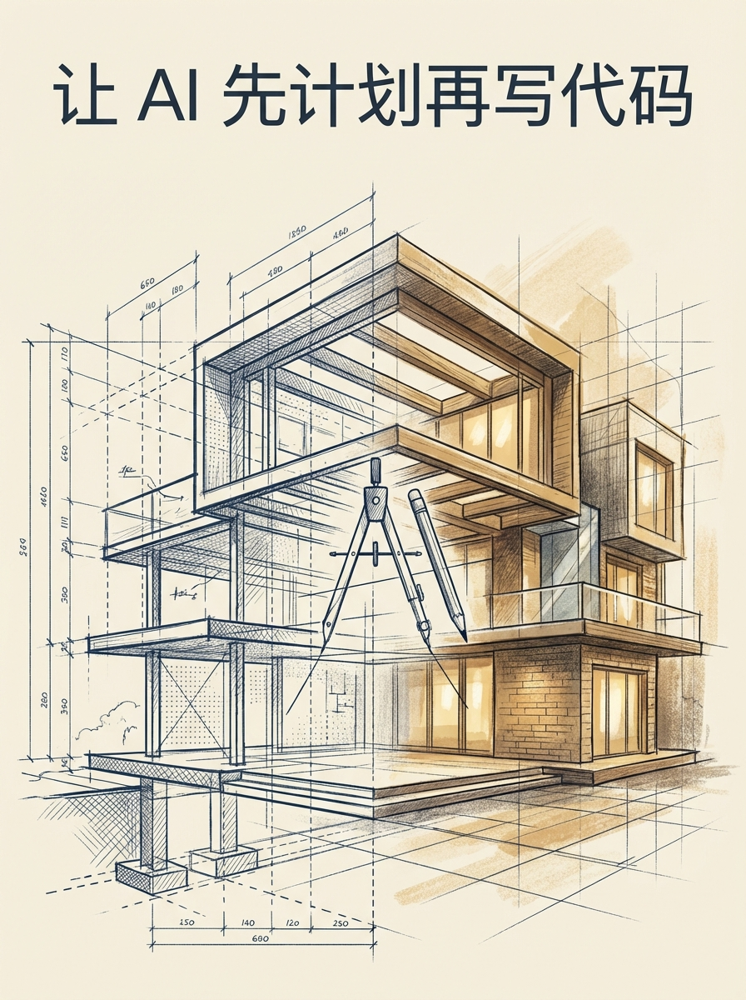

---

### 19 概念隐喻-display font

- **风格**：metaphor / elegant / hand-drawn / display font / balanced mood
- **基于**：10（handwritten→bold decorative display）
- **图片**：[查看](19-concept-metaphor-display/cover.png)

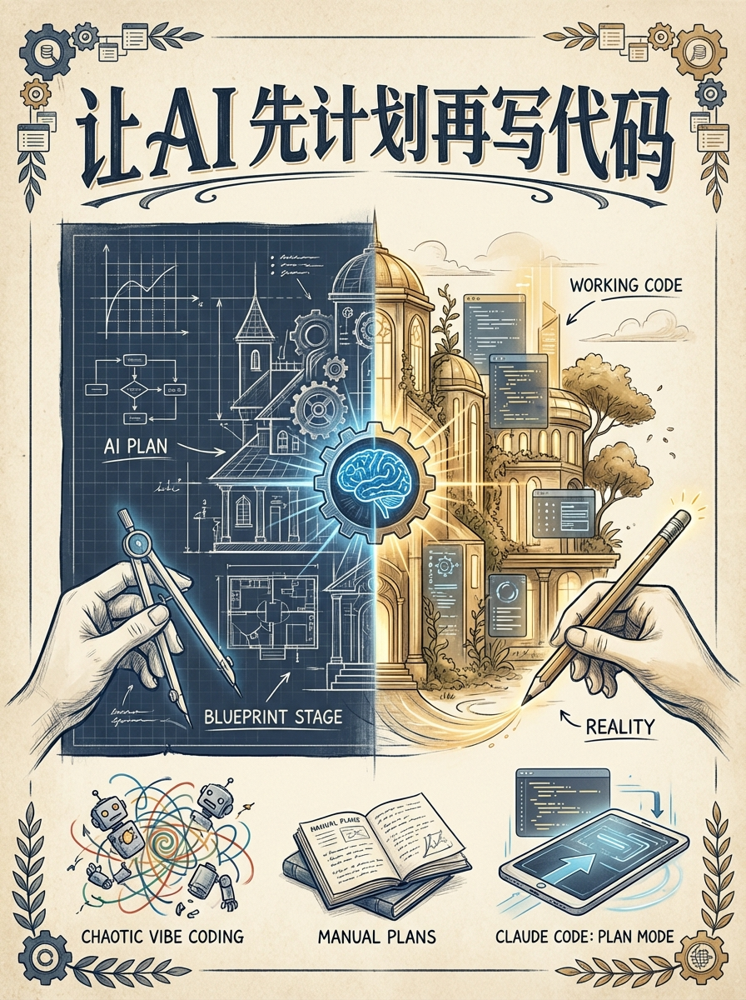

---

### 20 粉笔教学-clean font

- **风格**：metaphor / dark / chalk / clean font / balanced mood
- **基于**：12（handwritten→clean geometric sans-serif）
- **图片**：[查看](20-chalk-teaching-clean/cover.png)

---

## 快速对比维度（含变体）

| #      | 风格                  | 手机可读性 | 信息密度 | 个人调性  | 科技感   | 通用性   |
| ------ | ------------------- | ----- | ---- | ----- | ----- | ----- |
| 01     | 极简黑白                | ★★★★★ | ★    | ★★    | ★★★   | ★★★★★ |
| 02     | 极简数码                | ★★★★★ | ★★   | ★★    | ★★★★  | ★★★★★ |
| 03     | 字体主导-暗色             | ★★★★★ | ★★   | ★★★   | ★★★★  | ★★★★  |
| 04     | 字体主导-冷色             | ★★★★★ | ★★   | ★★    | ★★★★★ | ★★★★  |
| 05     | 概念-冷色数码             | ★★★★  | ★★★  | ★★    | ★★★★★ | ★★★★  |
| 06     | 概念-扁平暖色             | ★★★★  | ★★★  | ★★★★  | ★★    | ★★★★  |
| 07     | Notion 风            | ★★★★★ | ★★   | ★★★   | ★★★★  | ★★★★★ |
| 08     | 温暖手绘                | ★★★   | ★★★  | ★★★★★ | ★     | ★★★   |
| 09     | 手绘笔记                | ★★★   | ★★★  | ★★★★★ | ★     | ★★★   |
| 10     | 概念隐喻                | ★★★   | ★★★★ | ★★★★  | ★★    | ★★★   |
| 11     | 复古数码                | ★★★★  | ★★★  | ★★★   | ★★★★  | ★★    |
| 12     | 粉笔教学                | ★★★   | ★★★  | ★★★★  | ★★    | ★★★   |
| **13** | **字体-暖色暗底**         | ★★★★★ | ★★   | ★★★★  | ★★★   | ★★★★  |
| **14** | **字体-暖色**           | ★★★★★ | ★★   | ★★★★  | ★★★   | ★★★★  |
| **15** | **概念-暖色数码**         | ★★★★  | ★★★  | ★★★   | ★★★   | ★★★★  |
| **16** | **手绘-clean font**   | ★★★★  | ★★★  | ★★★★  | ★★    | ★★★★  |
| **17** | **手绘-display font** | ★★★★  | ★★★  | ★★★★  | ★★    | ★★★   |
| **18** | **隐喻-clean font**   | ★★★★  | ★★★★ | ★★★   | ★★★   | ★★★★  |
| **19** | **隐喻-display font** | ★★★★  | ★★★★ | ★★★★  | ★★    | ★★★   |
| **20** | **粉笔-clean font**   | ★★★★  | ★★★  | ★★★   | ★★    | ★★★★  |
| **23** | **极简大字-黑白**        | ★★★★★ | ★    | ★★★   | ★★    | ★★★★★ |
| **24** | **极简大字-黄填充**      | ★★★★★ | ★    | ★★★★  | ★★    | ★★★★  |
| **25** | **极简大字-暗底黄**      | ★★★★★ | ★    | ★★★★  | ★★★   | ★★★★  |
| **26** | **极简大字-渐变**        | ★★★★★ | ★    | ★★★★  | ★★    | ★★★★  |
| **27** | **极简大字-三色**        | ★★★★★ | ★★   | ★★★★  | ★★★   | ★★★★  |

---

## 变体组：极简大字体（5 种）

### 23 极简大字-黑白

- **风格**：minimal / mono / flat-vector / bold-outlined font (黑描边+白填充) / bold mood
- **特点**：粗黑描边白填充大字，浅灰底，极简线条图标
- **图片**：[查看](23-minimal-bold-bw/cover.png)

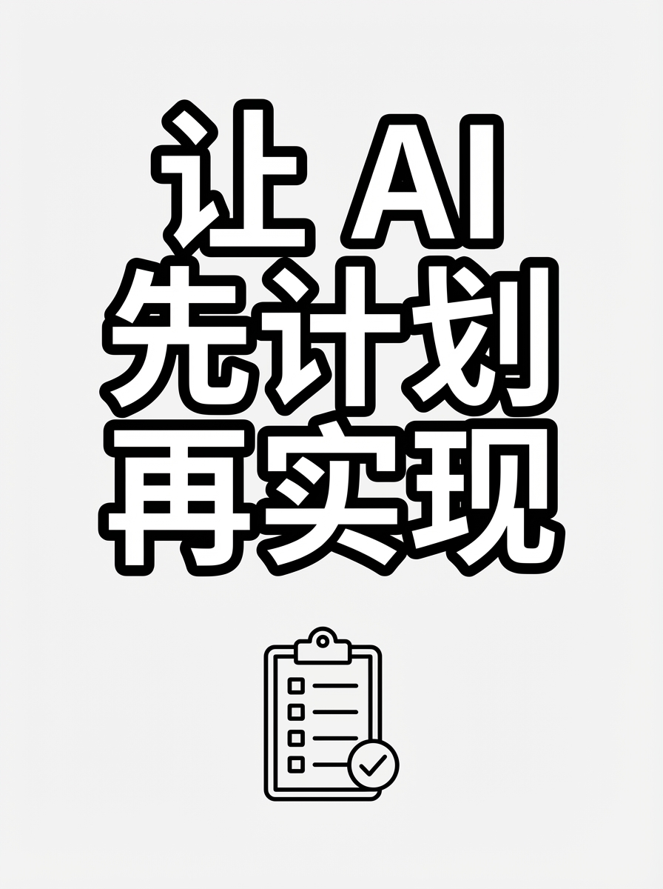

---

### 24 极简大字-黄填充

- **风格**：minimal / warm-accent / flat-vector / bold-outlined font (黑描边+黄填充) / bold mood
- **特点**：粗黑描边亮黄填充大字，白底，极简线条图标
- **图片**：[查看](24-minimal-bold-yellow/cover.png)

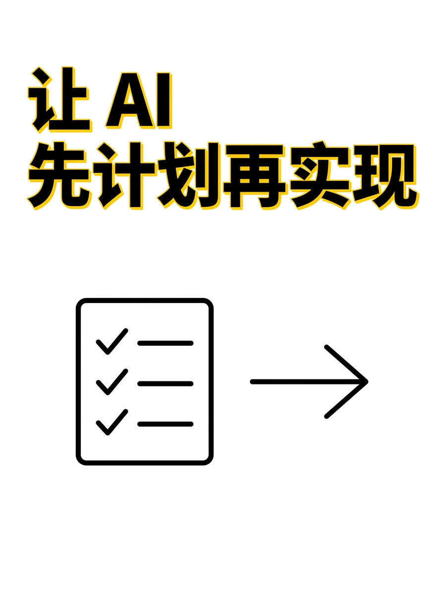

---

### 25 极简大字-暗底黄

- **风格**：minimal / dark / flat-vector / solid-yellow font (纯亮黄无描边) / bold mood
- **特点**：纯亮黄大字，深色/黑色背景，白色线条图标
- **图片**：[查看](25-minimal-solid-yellow/cover.png)

---

### 26 极简大字-渐变

- **风格**：minimal / warm-gradient / flat-vector / bold-outlined font (黑描边+黄→橙渐变填充) / bold mood
- **特点**：黑描边渐变填充（黄→橙）大字，浅色底，极简几何形状
- **图片**：[查看](26-minimal-bold-gradient/cover.png)

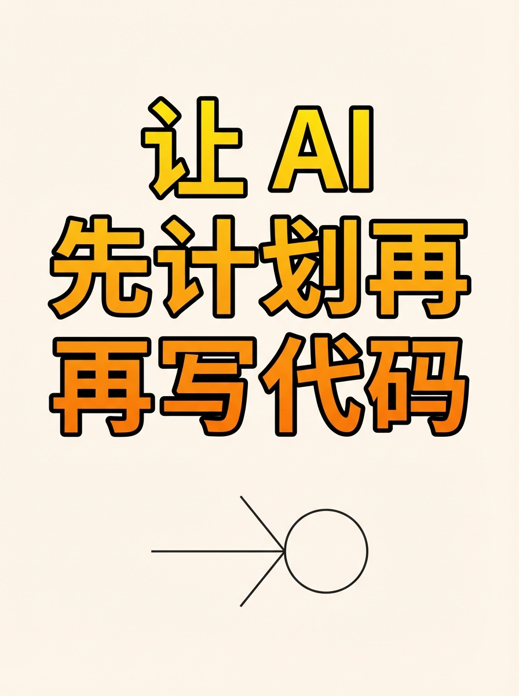

---

### 27 极简大字-三色

- **风格**：minimal / tricolor (黄/白/黑) / flat-vector / bold-outlined font (黑描边+白填充) / pop mood
- **特点**：三色分区布局（黄块/白块/黑块），黑描边白填充大字，极简图标
- **图片**：[查看](27-minimal-pop-tricolor/cover.png)

---

## 下一步

1. 打开此文件（Markdown 预览）逐张查看
2. 选定 1-2 种你喜欢的风格编号
3. 我来更新 `.baoyu-skills/baoyu-cover-image/EXTEND.md` 的 preferred 字段

