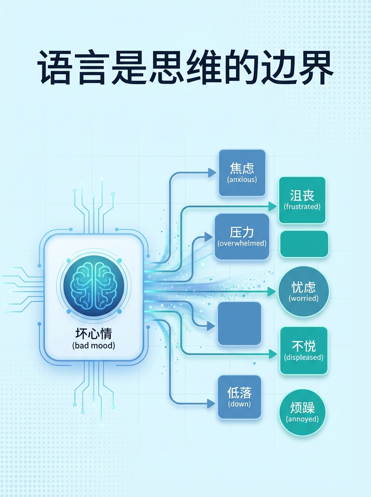
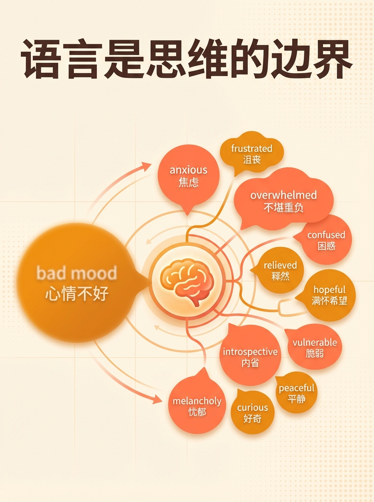
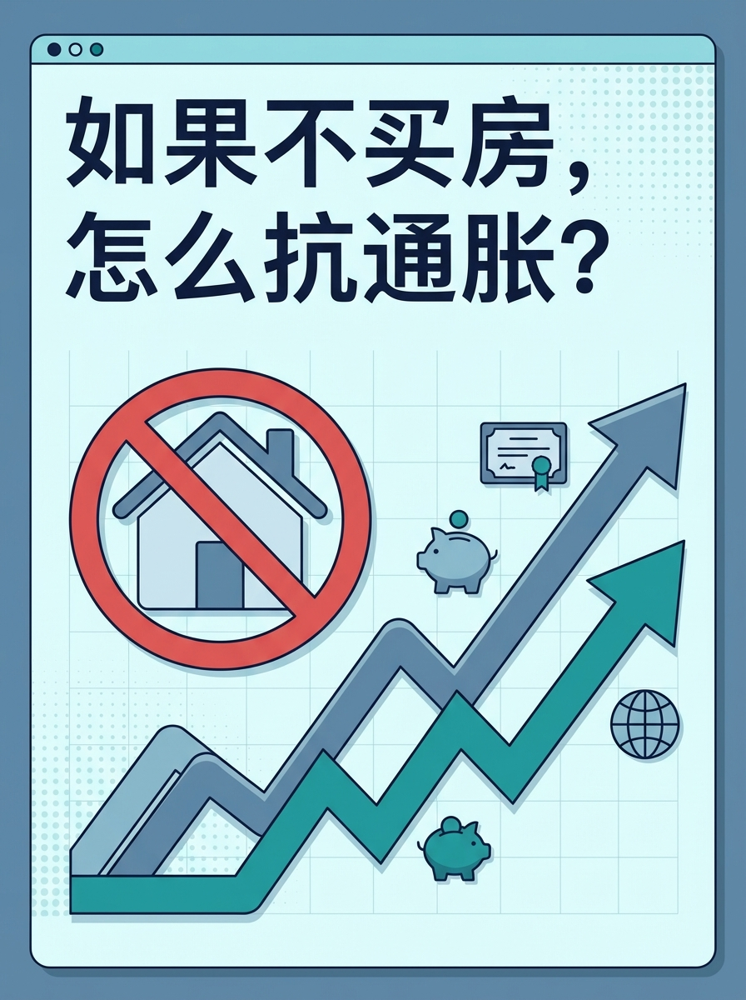
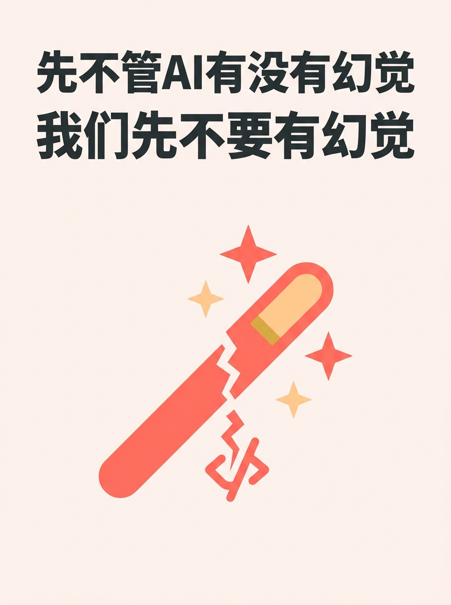
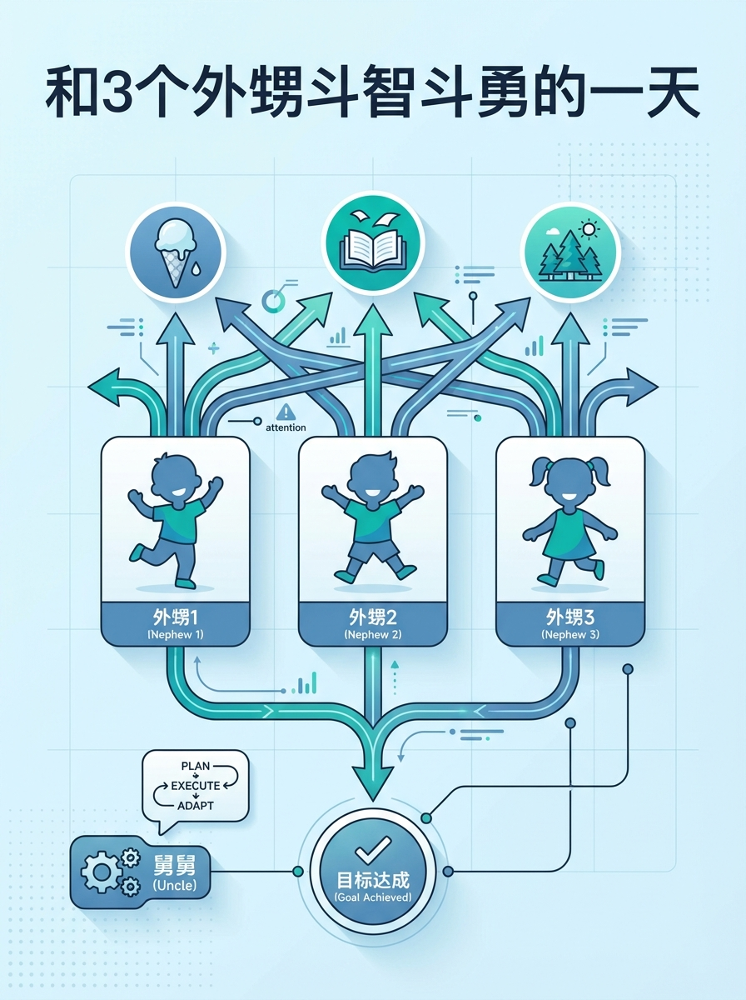
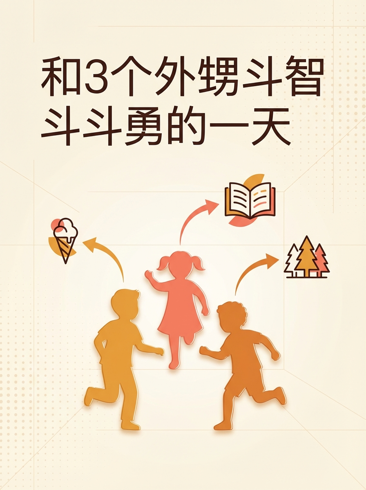
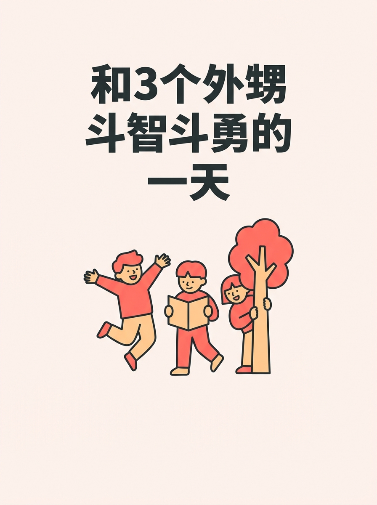
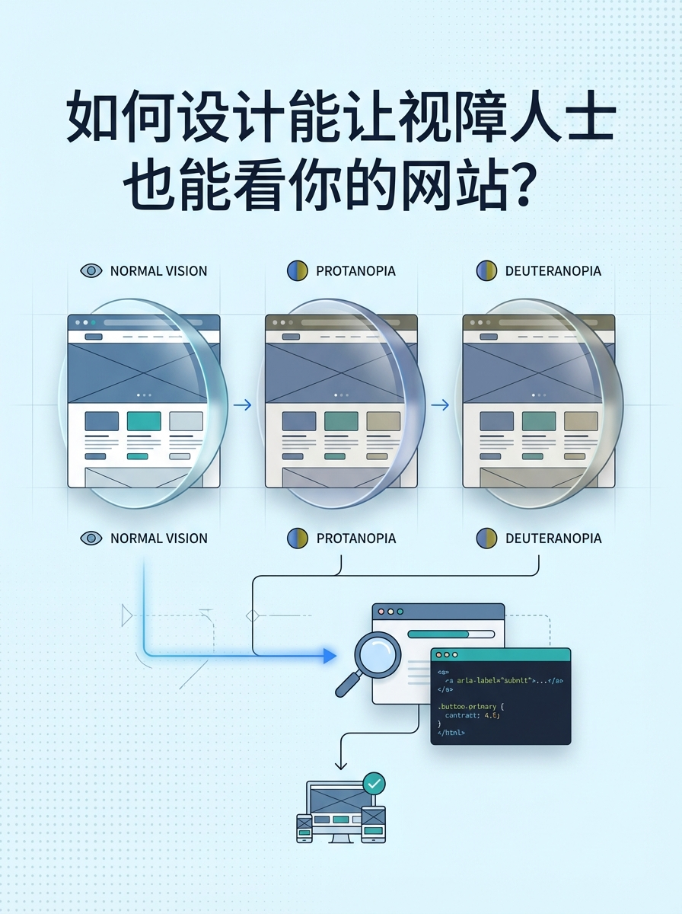
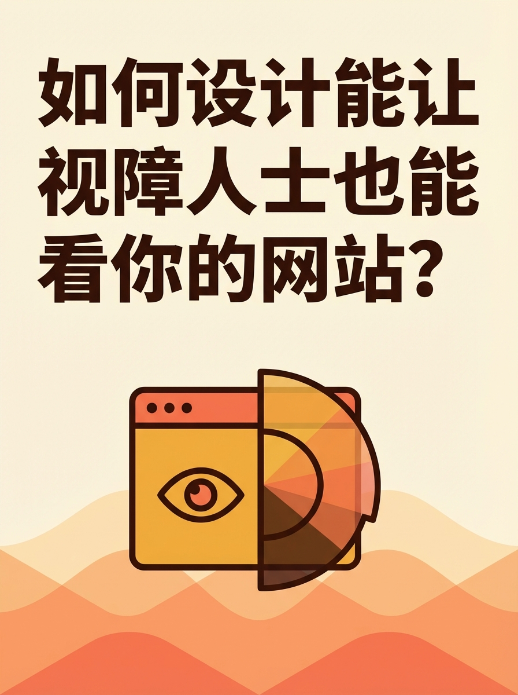
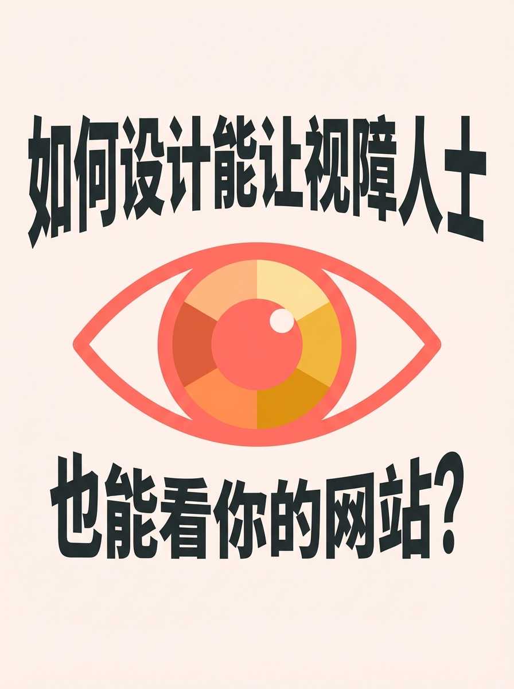

# Cover Image Style Test Report

5 preferred styles x 7 sample articles = 35 images

Generated with: Google Gemini / 3:4 / normal quality

---

## Style Overview

| Style | Type | Palette | Rendering | Font | Mood |
|-------|------|---------|-----------|------|------|
| typography-cool | typography | cool | flat-vector | clean | bold |
| conceptual-cool | conceptual | cool | digital | clean | balanced |
| typography-warm | typography | warm | flat-vector | clean | bold |
| conceptual-warm | conceptual | warm | digital | clean | balanced |
| minimal-warm-flat | minimal | warm | flat-vector | display | bold |

---

## Article 1: 语言是思维的边界

| typography-cool | conceptual-cool | typography-warm | conceptual-warm | minimal-warm-flat |
|:---:|:---:|:---:|:---:|:---:|
|  |  |  |  |  |

---

## Article 2: 如果不买房，怎么抗通胀？

| typography-cool | conceptual-cool | typography-warm | conceptual-warm | minimal-warm-flat |
|:---:|:---:|:---:|:---:|:---:|
|  |  |  |  |  |

---

## Article 3: 先不管AI有没有幻觉，我们先不要有幻觉

| typography-cool | conceptual-cool | typography-warm | conceptual-warm | minimal-warm-flat |
|:---:|:---:|:---:|:---:|:---:|
|  |  |  |  |  |

---

## Article 4: AutoHighlight AI 正式上线

| typography-cool | conceptual-cool | typography-warm | conceptual-warm | minimal-warm-flat |
|:---:|:---:|:---:|:---:|:---:|
|  |  |  |  |  |

---

## Article 5: 和3个外甥斗智斗勇的一天

| typography-cool | conceptual-cool | typography-warm | conceptual-warm | minimal-warm-flat |
|:---:|:---:|:---:|:---:|:---:|
|  |  |  |  |  |

---

## Article 6: 现在的小孩挺难的

| typography-cool | conceptual-cool | typography-warm | conceptual-warm | minimal-warm-flat |
|:---:|:---:|:---:|:---:|:---:|
|  |  |  |  |  |

---

## Article 7: 如何设计能让视障人士也能看你的网站？

| typography-cool | conceptual-cool | typography-warm | conceptual-warm | minimal-warm-flat |
|:---:|:---:|:---:|:---:|:---:|
|  |  |  |  |  |
