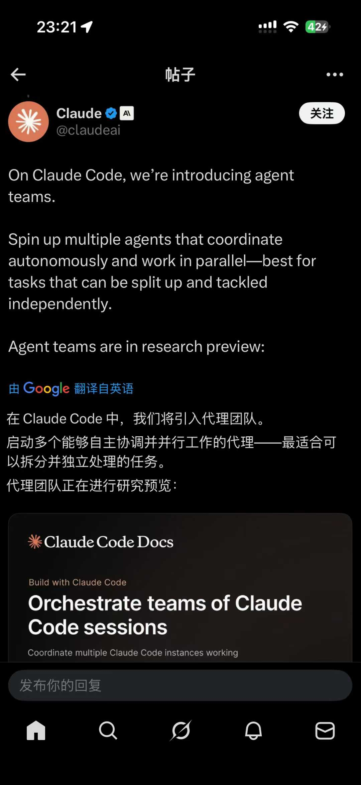
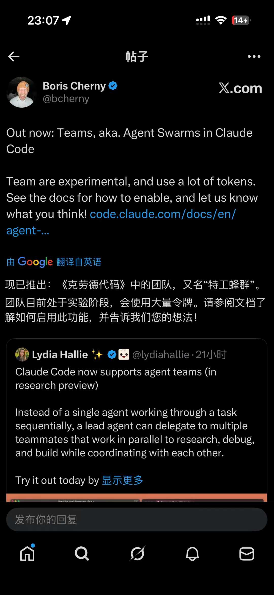
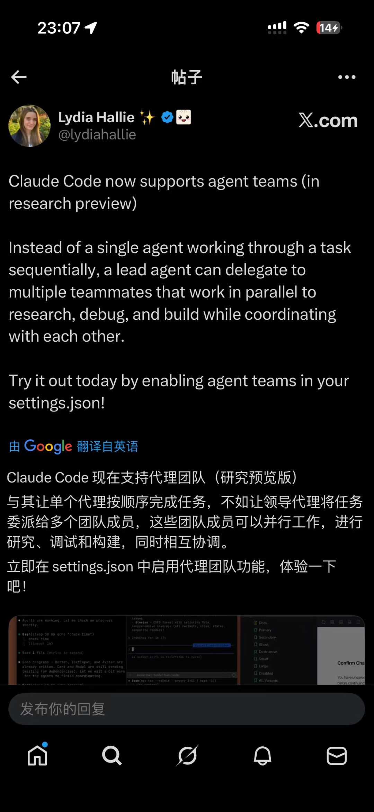

Claude Code 更新速度太快了…

随着 opus4.6 的发布，我最近遇到折腾半天的问题都有了解决方案…

比如怎么复盘自己使用Claude Code 的过程，提升使用效率？ 

现在输入/insights 就可以了

再比如怎么用 subagent，skills 这些把 AI 用成一个团队，而不止是一个编程助手… 我折腾了半天 Gemini Codex Claude 相互review 的时候还是有错，调了好久才算勉强能用… 

然后，它直接发布了agent teams 功能…

