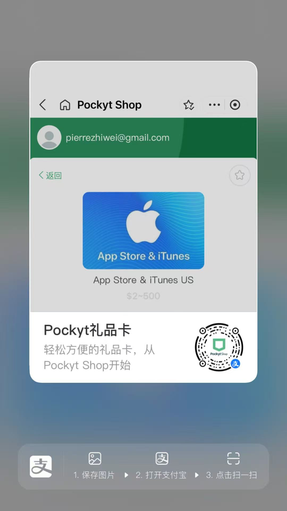

# 中国大陆订阅 Claude Pro 完整教程（小白版）

> 美区 Apple ID + 支付宝礼品卡 + iOS/macOS 内购订阅 ClaudeCode

## 需要准备什么

- 邮箱 — 一个**没有注册过 Apple ID** 的邮箱（Gmail、Outlook、QQ 邮箱均可）

- 手机号 — 中国大陆手机号即可（+86），用于接收验证码

- 支付宝 — 已实名认证，用于购买礼品卡

- iPhone 或 iPad — 用于通过 Apple ID 余额完成订阅（**必须**，Mac 上无法使用 Apple ID 余额订阅）

- 科学上网工具 — **必须**，推荐机场+ Clash Verge Rev（下文详述）

---

## 第一步：准备科学上网环境（美国 IP）

设置美区 ID 支付方式、注册 Claude 账号、使用 Claude 都需要海外（建议**美国 IP**）。（注册 Apple ID 和买礼品卡不需要，用正常网络即可。）

你需要两样东西：

1. **机场**（代理服务商）— 提供美国节点的线路，大多数机场都支持 Clash 订阅格式，直接复制订阅链接在 **Clash Verge Rev** 里配置即可

2. **Clash Verge Rev**（代理客户端）— 官网下载：[https\://clashverge.net/](https://clashverge.net/) ，支持 macOS / Windows / Linux 和移动端，安装和使用参考[教程](https://portal.shadowsocks.au/knowledgebase/32/Trojan-LiteorPro-%E6%9C%8D%E5%8A%A1-%E5%AE%A2%E6%88%B7%E7%AB%AF%E8%AE%BE%E7%BD%AE%E6%95%99%E7%A8%8B)

安装好后，导入机场订阅链接，选择一个**美国节点**，同时开启**系统代理 + TUN 模式**，就搞定了。

> **⚠️ 验证方法：** 浏览器打开 [https\://ip.sb](https://ip.sb) ，确认显示的国家是 **US**。如果不是，说明代理没生效，后续操作会遇到问题。

> **重要提醒：**
>
> - 使用 Claude 全程建议**保持同一个美国节点**，频繁切换 IP 可能触发风控
>
> - Clash Verge Rev 详细配置方法见文末 Q\&A

---

## 第二步：注册美区 Apple ID

1. 打开 [Apple ID 注册页面](https://appleid.apple.com/account)（无需科学上网）

2. 填写注册信息：

   - **Country/Region**：选择 **United States**

   - **Name**：填英文名（随意，如 Li Wei）

   - **Birthday**：生日设为 25 岁以上（部分内容有年龄限制）

   - **Email**：填写你准备好的邮箱（这就是你的 Apple ID）

   - **Password**：至少 8 位，包含大小写字母和数字，**不要包含姓名或生日**

   - **Phone Number**：选 +86，填你的手机号

3. 完成**邮箱验证码** + **手机验证码**验证

4. 注册成功

### 补充账单地址

首次在 App Store 登录美区 ID 时，**必须开启科学上网并使用美国节点**，否则付款方式不会出现 "None" 选项。登录后会要求填写账单地址，**选免税州可以避免额外税费**，推荐用 Oregon（俄勒冈州）：

- **State** — Oregon

- **City** — Portland

- **Street** — 在 [https\://www\.fakexy.com/](https://www.fakexy.com/) 生成一个美国地址即可（记得选免税州，如 Oregon）

- **Zip Code** — 97201

- **Phone** — 503 + 7 位随机数字（如 503-555-0123）

- **Payment** — **选择 None**

> **⚠️ 看不到 "None" 付款选项？这是最常见的问题！**
>
> - 原因几乎都是 **IP 地址不是美国的**
>
> - 解决：确认 Clash Verge 已开启系统代理 + TUN 模式，并选中美国节点
>
> - 验证：浏览器打开 [https\://ip.sb](https://ip.sb) ，确认国家显示 **US** 后再操作

> **重要提醒：**
>
> - 密码不要和其他账号重复，开启**双重认证**保护账号安全
>
> - **不要从 iPhone「设置」登录美区 ID**，只在 App Store 中登录！从设置登录会把 iCloud 也切换过去，可能导致数据丢失甚至设备被锁

---

## 第三步：通过支付宝购买美区 Apple 礼品卡

1. 打开**支付宝**，扫下面的码进入 Pockyt Shop

1. 搜索 **Apple** 或 **App Store**，选择 **"App Store & iTunes US"**

2. 注册登录后，输入充值金额，支付宝付款

3. 支付完成后，**立即看到兑换码**（16 位字母数字），同时邮箱也会收到

### 充值多少？

- Claude Pro — \$20/月

- Claude Max 5x — \$125/月

- Claude Max 20x — \$250/月

> **⚠️ 重要提醒：**
>
> - **不要贪便宜买低价礼品卡！** 淘宝/闲鱼上低于面值的卡很可能是"黑卡"（盗刷信用卡购买），使用后会导致你的 **Apple ID 被封禁**，甚至设备被锁
>
> - 正规渠道价格 = 面值 × 实时汇率（可能有小幅折扣，但不会打很大的折）
>
> - 确认买的是**美区（US）** 的 Apple Gift Card
>
> - 保存好兑换码，**每个码只能用一次**

---

## 第四步：兑换礼品卡 + 下载 Claude + 订阅

> **只有 iPhone / iPad 才能通过 Apple ID 余额订阅。** macOS 桌面版 Claude 的升级按钮会跳转到网页支付，网页端只接受信用卡/借记卡，无法使用 Apple ID 余额。请使用 iPhone 或 iPad 完成以下操作。

**兑换礼品卡：**

1. 打开 **App Store** → 点击右上角**头像**

2. 如果当前是国区 ID，先点**退出登录**，然后**登录美区 Apple ID**

3. 点击 **Redeem Gift Card or Code** → **Enter Code Manually**

4. 粘贴兑换码，点击 **Redeem**，成功后余额显示在账户页面顶部

**下载 Claude 并订阅：**

5. 在 App Store 搜索 **Claude**（开发者：Anthropic），下载安装

6. 打开 Claude App，**保持科学上网**，注册或登录 Claude 账号

7. 进入 **Settings** → **Subscription**，选择订阅方案：

   - **Claude Pro**：\$20/月 — 适合日常对话 + 轻度 Claude Code

   - **Claude Max 5x**：\$125/月 — 5 倍用量，Claude Code 日常使用推荐

   - **Claude Max 20x**：\$250/月 — 20 倍用量，Claude Code 重度用户推荐

8. 点击订阅，系统自动从 Apple ID 余额扣款

9. 订阅完成！

### macOS 用户注意

macOS 桌面版 Claude App 虽然可以从 App Store 下载，但**不支持 App Store 内购订阅**。点击升级按钮会跳转到网页端支付页面，而网页端只接受 Visa / Mastercard 等外币信用卡，**无法使用 Apple ID 余额**。

**如果你有 iPhone 或 iPad：**

- 先在 iPhone / iPad 上按「方式一」完成订阅

- 订阅状态会**自动同步**到 macOS 桌面端和网页版 claude.ai，无需重复操作

- macOS 上正常下载 Claude App 登录同一账号即可使用

**如果你没有 iPhone / iPad：**

- 你需要一张支持外币支付的 **Visa / Mastercard 信用卡或借记卡**

- 通过网页端 [claude.ai](https://claude.ai) 登录后，在 Settings → Subscription 中使用信用卡订阅

- 本教程的礼品卡方案不适用于这种情况

> **提醒：**
>
> - 切换 App Store 账号**不影响 iCloud**。你可以 iCloud 用国区 ID（保留通讯录、照片等），App Store 单独登美区 ID
>
> - 通过 iPhone / iPad 的 App Store 订阅后，**macOS 桌面端、网页版 claude.ai 和 Claude Code 都会同步为 Pro/Max 状态**，不需要重复订阅
>
> - Apple 内购订阅会**自动续费**，确保 Apple ID 余额充足，否则订阅会自动暂停
>
> - 取消订阅：iPhone「设置」→ Apple ID → 订阅 → Claude → 取消订阅

---

## 大功告成！

到这里你已经成功订阅了 Claude Pro/Max。你可以：

- **iPhone / macOS**：打开 Claude App 直接使用

- **网页版**：访问 [https\://claude.ai](https://claude.ai) 登录使用

- **Claude Code（Terminal）**：安装和配置将在下一篇教程中详细介绍

---

## 常见问题

### Q：Clash Verge Rev 怎么配置？

A：

1. 安装后打开，点击左侧 **Profiles**，在顶部输入框粘贴机场给的**订阅链接**，点击 **Import** 导入

2. 点击左侧 **Proxies**，在节点列表中选择一个**美国节点**（带有 US / 美国 标识）

3. 点击左侧 **Settings**，同时开启 **System Proxy**（系统代理）和 **TUN 模式**（Clash Field → TUN）

4. 建议选择**规则模式（Rule）**，国内网站走直连、海外走代理，日常使用更顺畅

### Q：为什么要同时开系统代理和 TUN 模式？

A：

- **系统代理**：让浏览器等常规应用走代理

- **TUN 模式**：接管所有网络流量（包括终端、命令行工具）

- **如果只开 TUN 不开系统代理，部分 UDP 转发会失效**，可能导致 Claude 检测到你不在美国

- 两者同时开启可以确保万无一失

### Q：机场订阅有什么要求？

A：Clash Verge Rev 基于 Clash Meta 内核，支持主流协议（Shadowsocks、VMess、Trojan、VLESS、Hysteria2 等）。绝大多数机场都提供 **Clash 订阅链接**，直接导入即可。选机场时只要注意：

- 必须有**美国节点**

- 推荐稳定的中大型机场，不建议用免费节点（不稳定且有安全风险）

### Q：首次登录 App Store 看不到 "None" 付款选项？

A：几乎都是因为 IP 不是美国。注册 Apple ID 不需要科学上网，但**首次在 App Store 登录美区 ID 时必须使用美国 IP**，付款方式才会出现 "None" 选项。请确认 Clash Verge 已开启系统代理 + TUN 模式，并选择了美国节点。浏览器访问 [https\://ip.sb](https://ip.sb) 确认国家是 US 后再操作。

### Q：注册时选了美国，但登录 App Store 后发现还是中国大陆怎么办？

A：这说明你的 Apple ID 地区没有成功切换到美国，或者被自动重置了。解决方法：**开启科学上网并使用美国节点**，然后在 App Store 中点击右上角头像 → 点击你的 Apple ID → **Country/Region（国家/地区）** → 选择 **United States** → 按提示填写美国地址信息（参考上文免税州地址）。修改完成后退出 App Store 重新进入即可。

### Q：支付宝里找不到 Pockyt Shop / 礼品卡入口？

A：支付宝的入口经常调整。如果找不到，可以直接通过 Pockyt Shop 官网购买：[https\://shop.pockyt.io](https://shop.pockyt.io) ，支持支付宝扫码付款，效果一样。

### Q：有其他购买礼品卡的渠道吗？

A：

- **Pockyt Shop 官网**（推荐备选）：[https\://shop.pockyt.io](https://shop.pockyt.io) ，支付宝付款

- **Apple 官网**：[https\://www\.apple.com/shop/buy-gift-cards](https://www.apple.com/shop/buy-gift-cards) ，需要 Visa/Mastercard 外币信用卡

- **淘宝/闲鱼**：**注意风险**，低价卡大概率是黑卡，会导致 Apple ID 被封

### Q：美区 Apple ID 会影响我现有的国区 ID 吗？

A：不会。建议：

- **iCloud 保持国区 ID**（保留通讯录、照片、iMessage 等）

- **App Store 单独切换到美区 ID**（仅用于下载和订阅）

### Q：可以在 iPhone 上直接注册美区 Apple ID 吗？

A：可以。设置 → 顶部头像 → 退出登录 → 登录 iPhone → 没有或忘记 Apple ID → 创建 Apple ID → 国家选 United States。注册本身不需要科学上网，但**首次在 App Store 登录时需要美国 IP，付款方式才会出现 "None" 选项**。整体来说官网注册更简单直观，推荐优先用官网。

### Q：支付宝买礼品卡汇率怎么算？

A：按实时汇率结算，通常接近银行中间价。\$20 ≈ ¥145 左右（视汇率波动）。Pockyt Shop 偶尔有小幅折扣。

### Q：订阅后可以取消吗？

A：可以。iPhone「设置」→ Apple ID → 订阅 → Claude → 取消订阅。取消后当前周期内仍可使用，到期后不再续费。

### Q：Pro 和 Max 怎么选？

A：

- **Pro（\$20/月）**：适合日常对话 + 轻度 Claude Code 使用

- **Max 5x（\$125/月）**：5 倍用量，Claude Code 日常使用推荐

- **Max 20x（\$250/月）**：20 倍用量，Claude Code 重度用户 / 团队推荐

> Claude Code 的安装和使用将在下一篇教程中详细介绍。

### Q：其他免税州地址可以用吗？

A：可以。除了 Oregon，以下免税州也可以：

- Delaware — Wilmington, 302, 19801

- Montana — Billings, 406, 59101

- New Hampshire — Manchester, 603, 03101

- Alaska — Anchorage, 907, 99501

---

## 费用总结

- 美区 Apple ID — 免费

- 科学上网工具（机场） — 约 ¥15-50/月（视机场而定）

- Apple 礼品卡 — 面值 × 实时汇率（如 \$20 ≈ ¥145）

- Claude Pro — \$20/月（≈ ¥145/月）

- Claude Max 5x — \$125/月（≈ ¥910/月）

- Claude Max 20x — \$250/月（≈ ¥1820/月）

> 汇率仅供参考，以实际支付时为准。

---

## 参考资料

- [美区 Apple ID 注册教程 - 小木研习社](https://www.xmpick.com/apple-id/)

- [2025 最全美区 Apple ID 注册教程 - Extrabux](https://www.extrabux.com/chs/guide/5532699)

- [美区 Apple ID 礼品卡购买充值教程 - 知乎](https://zhuanlan.zhihu.com/p/636121931)

- [Clash Verge 使用教程](https://clashverge.la/tutorial/)

- [Claude Code 官方设置文档](https://code.claude.com/docs/zh-CN/setup)

